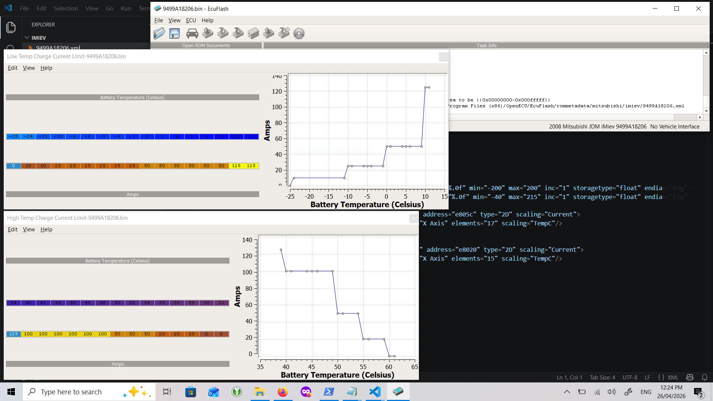

# Tactrix EcuFlash

Tactrix EcuFlash is a tool for use with the Tactrix OpenPort
OBD tool, however, you do not need to have an actual Tactrix OpenPort (or clone) to install and use ECUFlash.

It is still useful to edit defined "maps" for the ecu, you just
need an XML definition file for your ecu image.

In this repo are map files for:
* [9499A18206 (EV-ECU 9499A182 software revision 06)](9499A18206.xml)

Create an imiev folder in the {Program Files}/OpenECU/EcuFlash/rommetadata/mitsubishi folder and them there.

You can then load the binary of the ECU dump into it and it will load the config and show you the maps defined in the file.

You can then edit this map data and save the edited ECU image.

