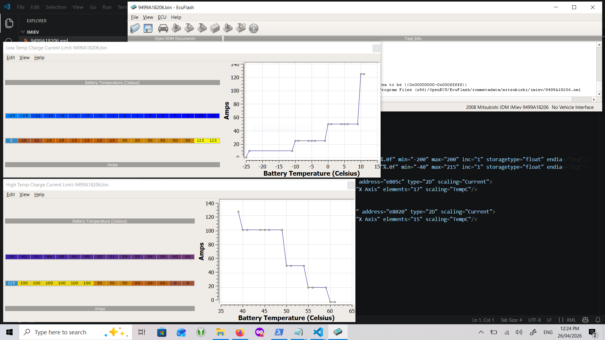

# Tactrix EcuFlash

Tactrix EcuFlash is a tool for use with the Tactrix OpenPort
OBD tool, however, you do not need to have an actual Tactrix OpenPort (or clone) to install and use ECUFlash.

It is still useful to edit defined "maps" for the ECU and BMU, you just
need an appropriate XML definition file for each.

In this repo are map files for:
* [9499A18206 (EV-ECU 9499A182 software revision 06)](9499A18206.xml)
* [9499B115 (BMU 9499B155 initial revision)](9499B155.xml)
* [9499A842 (BMU 9499B842 initial revision)](9499A842.xml)

The `9499B115` and `9499A842` are effectively the same, there are no code changes between them, only version identifiers.

Create an imiev folder in the `{Program Files}/OpenECU/EcuFlash/rommetadata/mitsubishi` folder and copy the above files there.

You can then load the binary generated by the `download-miev-firmware` tool into it and it will load the config and show you the maps defined in the file.

You can then edit this map data and save the edited ECU image.

Then use the `upload-miev-firmware` tool to put the modified file back into the ECU or BMU.

