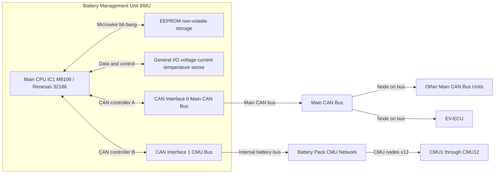

# Information about the BMU module

## General Arrangement

## BMU Version Timeline

[BMU version timeline](BMU_VERSION_TIMELINE.md)

## Main CPU (IC1)

Like the EV-ECU, the BMU firmware and memory map indicate a Mitsubishi branded
`M8106` CPU in a 144-pin LQFP package, matching the Renesas 32186 family.

This appears to use the same base architecture as EV-ECU:
* [Renesas 32186 hardware manual](https://www.renesas.com/en/document/mah/3218532186-group-hardware-manual)
* [M32R-FP instruction set](https://www.renesas.com/en/document/mah/m32r-fpu-software-manual)
* Single precision floating point support
* 2 CAN peripherals used for vehicle and battery-pack communications

## EEPROM and Persistent Data

The BMU stores identification and runtime data in non-volatile memory.
Detailed per-field mapping is still in progress.

## CAN Interfaces

The BMU bridges two CAN domains:
* Main vehicle CAN bus (`CAN Bus 0`)
* Internal battery-pack CAN bus to CMUs (`CAN Bus 1`)

This includes forwarding CMU diagnostic traffic between both buses and
publishing pack status (for example 0x373 and 0x374) on the main vehicle bus.

See full slot and PID tables here:
[BMU CAN mappings](can.md)

## ECU Identification data

Known BMU software part numbers and release markers are tracked in:
[BMU version timeline](BMU_VERSION_TIMELINE.md)
