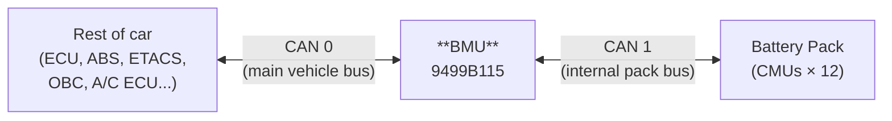

# 9499B115 (BMU) CAN

These tables are compiled from the BMU firmware.

## CAN bus arrangement

## CAN Bus 0 (main vehicle bus)

### TX slots, PIDs and DLCs (22)

| Slot | SID0/SID1 | CAN PID | DLC | Period    | Content |
|------|-----------|---------|-----|-----------|---------|
|  0   | 0x1D22    | 0x762   | 8   | On demand | ISO-TP diagnostic response |
|  1   | 0x1D22    | 0x762   | 8   | On demand | ISO-TP diagnostic response |
|  2   | 0x181F    | 0x61F   | 8   | On demand | ISO-TP diagnostic response from CMU 1 (forwarded from CAN bus 1) |
|  3   | 0x182F    | 0x62F   | 8   | On demand | ISO-TP diagnostic response from CMU 2 (forwarded from CAN bus 1) |
|  4   | 0x183F    | 0x63F   | 8   | On demand | ISO-TP diagnostic response from CMU 3 (forwarded from CAN bus 1) |
|  5   | 0x190F    | 0x64F   | 8   | On demand | ISO-TP diagnostic response from CMU 4 (forwarded from CAN bus 1) |
|  6   | 0x191F    | 0x65F   | 8   | On demand | ISO-TP diagnostic response from CMU 5 (forwarded from CAN bus 1) |
|  7   | 0x192F    | 0x66F   | 8   | On demand | ISO-TP diagnostic response from CMU 6 (forwarded from CAN bus 1) |
|  8   | 0x193F    | 0x67F   | 8   | On demand | ISO-TP diagnostic response from CMU 7 (forwarded from CAN bus 1) |
|  9   | 0x1A0F    | 0x68F   | 8   | On demand | ISO-TP diagnostic response from CMU 8 (forwarded from CAN bus 1) |
| 10   | 0x1A1F    | 0x69F   | 8   | On demand | ISO-TP diagnostic response from CMU 9 (forwarded from CAN bus 1) |
| 11   | 0x1A2F    | 0x6AF   | 8   | On demand | ISO-TP diagnostic response from CMU 10 (forwarded from CAN bus 1) |
| 12   | 0x1A3F    | 0x6BF   | 8   | On demand | ISO-TP diagnostic response from CMU 11 (forwarded from CAN bus 1) |
| 13   | 0x1B0F    | 0x6CF   | 8   | On demand | ISO-TP diagnostic response from CMU 12 (forwarded from CAN bus 1) |
| 14   | 0x0D33    | 0x373   | 8   | 10 ms     | Battery cell min/max voltage, pack voltage and current |
| 15   | 0x0D34    | [0x374](../can/374.md)   | 8   | 100 ms    | Battery SOC, temperatures |
| 16   | 0x0D35    | 0x375   | 8   | 100 ms    | Unknown, but ECU listens for this PID (only first 2 bytes ever non-zero) |
| 17   | 0x1621    | [0x5A1](../can/5A1.md)   | 8   | 50 ms     | BMU DTC status |
| 18   | 0x1B21    | 0x6E1   | 8   | 40 ms     | Cell voltages (group 1) |
| 19   | 0x1B22    | 0x6E2   | 8   | 40 ms     | Cell voltages (group 2) |
| 20   | 0x1B23    | 0x6E3   | 8   | 40 ms     | Cell voltages (group 3) |
| 21   | 0x1B24    | 0x6E4   | 8   | 40 ms     | Cell voltages (group 4) |

### RX slots, PIDs and DLCs (20)

| Slot | SID0/SID1 | CAN PID | DLC | Content | Source |
|------|-----------|---------|-----|---------|--------|
|  0   | 0x180E    | 0x60E   | 6   | ? | ? |
|  1   | 0x1D21    | 0x761   | 5   | ISO-TP diagnostic request | Scan tool |
|  2   | 0x1B0E    | 0x6CE   | 4   | ISO-TP diagnostic request for CMU 12 (forwarded to CAN bus 1) | Scan tool |
|  3   | 0x1A3E    | 0x6BE   | 8   | ISO-TP diagnostic request for CMU 11 (forwarded to CAN bus 1) | Scan tool |
|  4   | 0x1A2E    | 0x6AE   | 5   | ISO-TP diagnostic request for CMU 10 (forwarded to CAN bus 1) | Scan tool |
|  5   | 0x1A1E    | 0x69E   | 0   | ISO-TP diagnostic request for CMU 9 (forwarded to CAN bus 1) | Scan tool |
|  6   | 0x1A0E    | 0x68E   | 8   | ISO-TP diagnostic request for CMU 8 (forwarded to CAN bus 1) | Scan tool |
|  7   | 0x193E    | 0x67E   | 8   | ISO-TP diagnostic request for CMU 7 (forwarded to CAN bus 1) | Scan tool |
|  8   | 0x192E    | 0x66E   | 8   | ISO-TP diagnostic request for CMU 6 (forwarded to CAN bus 1) | Scan tool |
|  9   | 0x191E    | 0x65E   | 8   | ISO-TP diagnostic request for CMU 5 (forwarded to CAN bus 1) | Scan tool |
| 10   | 0x190E    | 0x64E   | 8   | ISO-TP diagnostic request for CMU 4 (forwarded to CAN bus 1) | Scan tool |
| 11   | 0x183E    | 0x63E   | 8   | ISO-TP diagnostic request for CMU 3 (forwarded to CAN bus 1) | Scan tool |
| 12   | 0x182E    | 0x62E   | 8   | ISO-TP diagnostic request for CMU 2 (forwarded to CAN bus 1) | Scan tool |
| 13   | 0x181E    | 0x61E   | 8   | ISO-TP diagnostic request for CMU 1 (forwarded to CAN bus 1) | Scan tool |
| 14   | 0x1024    | [0x424](../can/424.md)   | 8   | Car lights and locks status | ETACS |
| 15   | 0x1012    | 0x412   | 8   | Vehicle speed, odometer | Combination meter |
| 16   | 0x0A08    | [0x288](../can/288.md)   | 8   | Motor torque, speed and condenser voltage | Inverter |
| 17   | 0x0A06    | 0x286   | 8   | ? | EV-ECU |
| 18   | 0x0A05    | [0x285](../can/285.md)   | 8   | Acceleration | EV-ECU |
| 19   | 0x001C    | 0x01C   | 8   | Diagnostic messages (TesterPresent, StartDiagnosticSession) — only seen when MUT connected | Scan tool |

## CAN Bus 1 (BMU to CMU)

### TX slots, BMU to CMU (14)

| Slot | SID0/SID1 | CAN PID | DLC | Content |
|------|-----------|---------|-----|---------|
|  0   | 0x0F03    | 0x3C3   | 8   | Cell balancing command |
|  1   | 0x1B30    | 0x6F0   | 8   | ? |
|  2   | 0x1B31    | 0x6F1   | 8   | ISO-TP diagnostic request for CMU 1 (forwarded from CAN bus 0) |
|  3   | 0x1B32    | 0x6F2   | 8   | ISO-TP diagnostic request for CMU 2 (forwarded from CAN bus 0) |
|  4   | 0x1B33    | 0x6F3   | 8   | ISO-TP diagnostic request for CMU 3 (forwarded from CAN bus 0) |
|  5   | 0x1B34    | 0x6F4   | 8   | ISO-TP diagnostic request for CMU 4 (forwarded from CAN bus 0) |
|  6   | 0x1B35    | 0x6F5   | 8   | ISO-TP diagnostic request for CMU 5 (forwarded from CAN bus 0) |
|  7   | 0x1B36    | 0x6F6   | 8   | ISO-TP diagnostic request for CMU 6 (forwarded from CAN bus 0) |
|  8   | 0x1B37    | 0x6F7   | 8   | ISO-TP diagnostic request for CMU 7 (forwarded from CAN bus 0) |
|  9   | 0x1B38    | 0x6F8   | 8   | ISO-TP diagnostic request for CMU 8 (forwarded from CAN bus 0) |
| 10   | 0x1B39    | 0x6F9   | 8   | ISO-TP diagnostic request for CMU 9 (forwarded from CAN bus 0) |
| 11   | 0x1B3A    | 0x6FA   | 8   | ISO-TP diagnostic request for CMU 10 (forwarded from CAN bus 0) |
| 12   | 0x1B3B    | 0x6FB   | 8   | ISO-TP diagnostic request for CMU 11 (forwarded from CAN bus 0) |
| 13   | 0x1B3C    | 0x6FC   | 8   | ISO-TP diagnostic request for CMU 12 (forwarded from CAN bus 0) |

### RX slots, CMU to BMU (12)

Each CMU sends 4 messages covering cell voltages and temperatures. The PID masks are set on the RX slots so that the last nibble of the PID may be 1–4 (not matching literal `F`).

| Slot | SID0/SID1 | CAN PID | DLC | Content |
|------|-----------|---------|-----|---------|
| 14   | 0x181F    | 0x61F   | 8   | Cell voltage and temperature data from CMU 1 (4 messages, PID last digit 1–4) |
| 15   | 0x182F    | 0x62F   | 8   | Cell voltage and temperature data from CMU 2 (4 messages, PID last digit 1–4) |
| 16   | 0x183F    | 0x63F   | 8   | Cell voltage and temperature data from CMU 3 (4 messages, PID last digit 1–4) |
| 17   | 0x190F    | 0x64F   | 8   | Cell voltage and temperature data from CMU 4 (4 messages, PID last digit 1–4) |
| 18   | 0x191F    | 0x65F   | 8   | Cell voltage and temperature data from CMU 5 (4 messages, PID last digit 1–4) |
| 19   | 0x192F    | 0x66F   | 8   | Cell voltage and temperature data from CMU 6 (4 messages, PID last digit 1–4) |
| 20   | 0x193F    | 0x67F   | 8   | Cell voltage and temperature data from CMU 7 (4 messages, PID last digit 1–4) |
| 21   | 0x1A0F    | 0x68F   | 8   | Cell voltage and temperature data from CMU 8 (4 messages, PID last digit 1–4) |
| 22   | 0x1A1F    | 0x69F   | 8   | Cell voltage and temperature data from CMU 9 (4 messages, PID last digit 1–4) |
| 23   | 0x1A2F    | 0x6AF   | 8   | Cell voltage and temperature data from CMU 10 (4 messages, PID last digit 1–4) |
| 24   | 0x1A3F    | 0x6BF   | 8   | Cell voltage and temperature data from CMU 11 (4 messages, PID last digit 1–4) |
| 25   | 0x1B0F    | 0x6CF   | 8   | Cell voltage and temperature data from CMU 12 (4 messages, PID last digit 1–4) |
