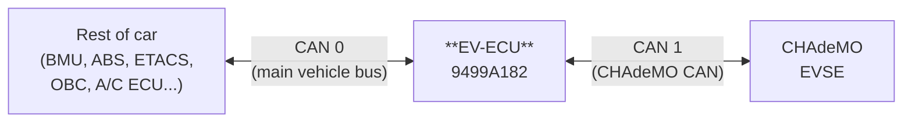

# 9499A182 (EV-ECU) CAN

These tables are compiled from the `9499A18206` firmware.

## CAN bus arrangement

## CAN bus 0 - Main Vehicle Bus

### TX slots, PIDs and DLCs (19)

| Slot | SID0/SID1 | CAN PID | DLC | Period | Content |
|------|-----------|---------|-----|--------|---------|
|  0   | 0x1D12    | 0x752   | 8   | On demand | ISO-TP diagnostic response |
|  1   | 0x1D12    | 0x752   | 8   | On demand | ISO-TP diagnostic response |
|  2   | 0x0C08    | 0x308   | 8   | 20 ms | ? |
|  3   | 0x1018    | [0x418](../can/418.md)   | 7   | 20 ms | Gear shift selection |
|  4   | 0x0D06    | 0x346   | 8   | 20 ms | Range remaining, handbrake |
|  5   | 0x0A05    | [0x285](../can/285.md)   | 8   | 10 ms | Acceleration |
|  6   | 0x0A12    | 0x292   | 8   | ? | ? (never seen in dumps) |
|  7   | 0x0A06    | 0x286   | 8   | 100 ms | ? |
|  8   | 0x1B10    | 0x6D0   | 8   | 50 ms | ? (always all-zero) |
|  9   | 0x1B11    | 0x6D1   | 8   | 50 ms | ? (possibly bitfields; seen: `0004000000000000`, `0000000000040000`, `0004000000040000`, `000C000000040000`) |
| 10   | 0x1B12    | 0x6D2   | 8   | 50 ms | ? (possibly bitfields; seen: `4000000001000000`) |
| 11   | 0x1B13    | 0x6D3   | 8   | 50 ms | ? (possibly bitfields; seen: `0000000050000000`) |
| 12   | 0x1B14    | 0x6D4   | 8   | 50 ms | ? (always all-zero) |
| 13   | 0x1B15    | 0x6D5   | 8   | 50 ms | ? (possibly bitfields; seen: `0004000000000000`, `000C000000000000`) |
| 14   | 0x1B1A    | 0x6DA   | 8   | 50 ms | ? (always all-zero) |
| 15   | 0x1A15    | 0x695   | 8   | 100 ms | ? |
| 16   | 0x1A16    | 0x696   | 8   | 100 ms | Motor current, regen amps |
| 17   | 0x1A17    | 0x697   | 8   | 100 ms | CHAdeMO status |
| 18   | 0x1B16    | 0x6D6   | 8   | 50 ms | ? (always all-zero) |

### RX slots, PIDs and DLCs (21)

| Slot | SID0/SID1 | CAN PID | DLC | Content | Source |
|------|-----------|---------|-----|---------|--------|
|  0   | 0x1D11    | 0x751   | 0   | ISO-TP diagnostic request | Scan tool |
|  1   | 0x1621    | [0x5A1](../can/5A1.md)   | 8   | BMU DTC status | BMU |
|  2   | 0x1528    | 0x568   | 2   | ? (charging only) | OBC |
|  3   | 0x1525    | 0x565   | 6   | ? (fixed values) | ? |
|  4   | 0x1524    | 0x564   | 8   | ? (fixed values) | ? |
|  5   | 0x1024    | [0x424](../can/424.md)   | 6   | Car lights and locks status | ETACS |
|  6   | 0x1012    | 0x412   | 5   | Vehicle speed, odometer | Combination meter |
|  7   | 0x0E24    | 0x3A4   | 4   | Climate console (fan, vent, mode) | A/C ECU |
|  8   | 0x0E09    | 0x389   | 6   | Charger voltages and currents (charging only) | OBC |
|  9   | 0x0E04    | 0x384   | 8   | AC, 12V and heater current draw | A/C ECU |
| 10   | 0x0D35    | 0x375   | 2   | ? (only first 2 bytes ever non-zero) | BMU |
| 11   | 0x0D34    | [0x374](../can/374.md)   | 8   | Battery SOC, temperatures | BMU |
| 12   | 0x0D33    | 0x373   | 8   | Battery cell min/max voltage, pack voltage and current | BMU |
| 13   | 0x0A18    | 0x298   | 4   | Motor temperatures | Inverter |
| 14   | 0x0A08    | [0x288](../can/288.md)   | 8   | Motor torque, speed and condenser voltage | Inverter |
| 15   | 0x0836    | 0x236   | 8   | ? | ABS |
| 16   | 0x0831    | 0x231   | 5   | Brake pedal switch | ABS |
| 17   | 0x0815    | 0x215   | 8   | Vehicle speed | ABS |
| 18   | 0x0808    | 0x208   | 8   | Wheel rotation, brake pedal position | ABS |
| 19   | 0x0800    | 0x200   | 6   | Wheel rotation | ABS |
| 20   | 0x0321    | 0x0E1   | 8   | ? (never seen in dumps) | ? |

## CAN bus 1 - ChaDeMo charger
